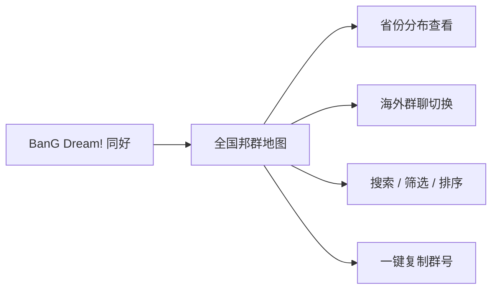
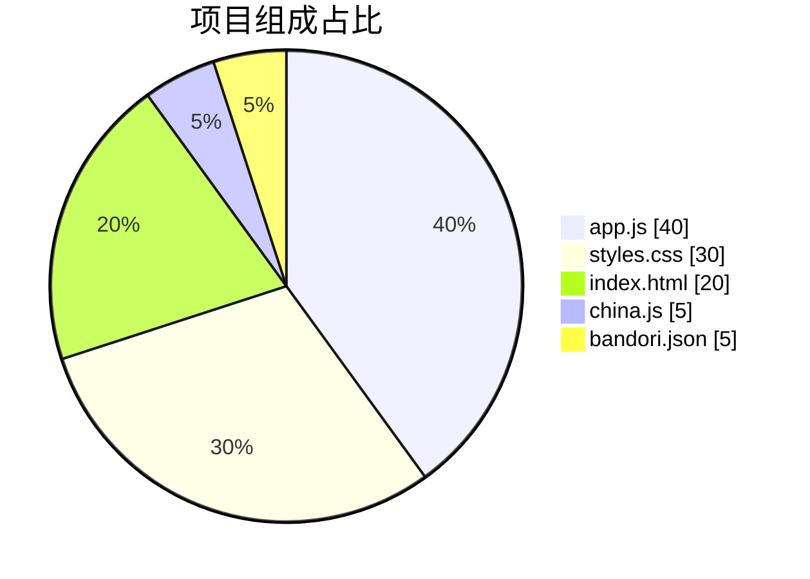
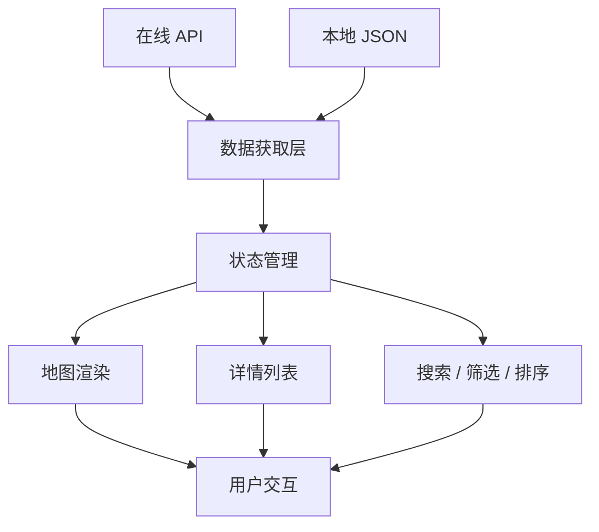
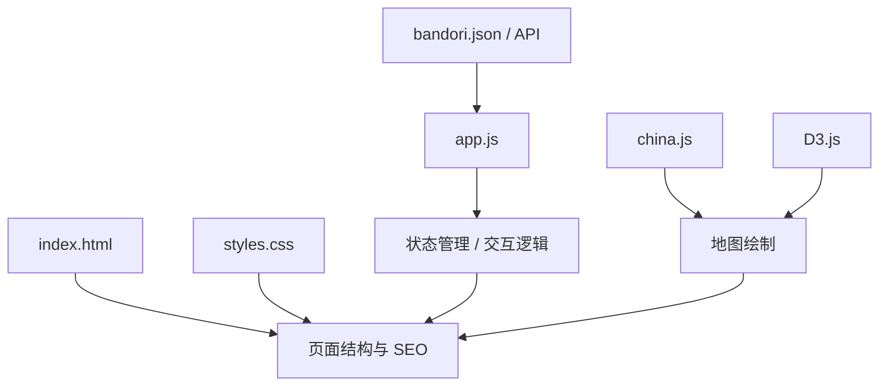
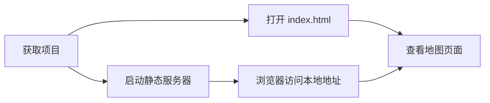
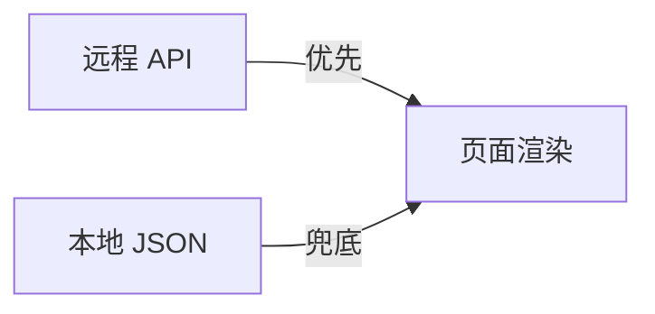
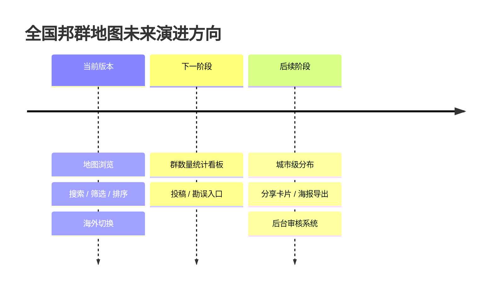

# 全国邦群地图 · BanG Dream! 同好社群导航

<div align="center">


<h3>一个面向 BanG Dream! 同好的全国群聊聚合地图站点</h3>

<p>以 <b>粉色 Material Design 3 风格</b> 为主题，聚合展示 <b>中国各省 + 海外地区</b> 的邦群信息，支持地图浏览、搜索筛选、复制群号、深浅色切换与移动端适配。</p>

<p>
  <a href="https://github.com/HELPMEEADICE/china-bandori-maps"></a>
  
  
  
</p>

<p>
  
  
  
  
  
  
</p>

</div>

## 🔗 项目入口

| 类型 | 地址 |
|---|---|
| GitHub 仓库 | https://github.com/HELPMEEADICE/china-bandori-maps |
| 在线接口 | `https://mapapi.enldm.cyou/api/bandori` |
| 本地兜底数据 | `./bandori.json` |

## ⭐ Star History

<div align="center">

[](https://star-history.com/#HELPMEEADICE/china-bandori-maps&Date)

</div>

---

## ✨ 项目速览

| 维度 | 内容 |
|---|---|
| 项目名称 | 全国邦群地图 |
| 项目类型 | 纯静态前端项目 |
| 技术栈 | HTML / CSS / JavaScript / D3.js |
| UI 风格 | Material Design 3 + 粉色主题 |
| 运行方式 | 浏览器直接打开或使用静态服务器 |
| 数据来源 | 在线 API + 本地 JSON 兜底 |
| 适配范围 | 桌面端 / 移动端 |
| 适用人群 | BanG Dream! 邦邦同好、群组整理者、社群维护者 |

### 项目状态面板

| 指标 | 状态 | 说明 |
|---|---|---|
| 项目形态 | ✅ 稳定静态站点 | 无需后端即可运行 |
| 可部署性 | ✅ 很高 | 可直接托管到静态平台 |
| 可维护性 | ✅ 清晰 | 结构简单、文件边界明确 |
| 可扩展性 | ✅ 良好 | 适合增加统计、筛选和投稿能力 |
| 社群价值 | ✅ 明显 | 提高同好群聊发现效率 |

### 一眼看懂项目定位



---

## 🗺️ 它能做什么

本项目核心目标，是把原本分散的 BanG Dream! 群聊信息，以一个 **直观、可浏览、可搜索、可复制** 的地图页面呈现出来。

### 功能总表

| 功能模块 | 说明 | 使用体验 |
|---|---|---|
| 中国地图浏览 | 在全国地图上查看各省群聊分布 | 直观定位地区 |
| 省份详情面板 | 点击省份查看对应群聊列表 | 信息集中展示 |
| 海外地区切换 | 查看国外 / 海外群组信息 | 支持扩展社群 |
| 全局搜索 | 通过群名 / 群号检索 | 快速查找目标 |
| 类型筛选 | 支持地区 / 校群 / 其他分类 | 减少浏览成本 |
| 排序切换 | 默认 / 认证时间 / 首字母 / 类型排序 | 查找更高效 |
| 一键复制群号 | 直接复制群号加入社群 | 降低操作门槛 |
| 深浅色模式 | 跟随系统或临时切换暗黑模式 | 更舒适的观感 |
| 移动端优化 | 底部抽屉、拖拽高度、触屏适配 | 手机上也好用 |
| 反馈入口 | 弹窗二维码 + 外链加群 | 便于问题反馈 |

---

## 📊 项目特性图表

### 1）产品能力雷达

| 能力项 | 等级 | 说明 |
|---|---:|---|
| 可视化表达 | 5/5 | 地图方式展示信息，理解成本低 |
| 交互完整度 | 5/5 | 缩放、拖拽、搜索、筛选、切换齐全 |
| 静态部署友好度 | 5/5 | 无需构建，无后端依赖 |
| 移动端适配 | 4/5 | 已适配抽屉交互与按钮布局 |
| 数据容错性 | 4/5 | API 异常时可回退本地 JSON |
| 可维护性 | 4/5 | 文件清晰，逻辑集中在脚本层 |

### 2）架构组成占比

| 组成部分 | 职责 | 占比感知 |
|---|---|---|
| `index.html` | 页面结构、SEO、元信息、组件容器 | 20% |
| `styles.css` | 视觉主题、动画、响应式布局 | 30% |
| `app.js` | 状态管理、交互逻辑、数据渲染 | 40% |
| `china.js` | 地图数据 / 地图绘制依赖 | 5% |
| `bandori.json` | 本地兜底数据源 | 5% |



### 3）数据流转示意

```text
在线 API / 本地 JSON
        │
        ▼
   数据获取与兜底
        │
        ▼
   省份分组与状态管理
        │
 ┌──────┼──────────────┐
 ▼      ▼              ▼
地图徽标 详情列表      搜索 / 筛选 / 排序
 │      │              │
 └──────┴──────┬───────┘
               ▼
           用户复制群号 / 加群 / 反馈
```



### 4）页面模块一览

| 页面区域 | 可见元素 | 主要职责 |
|---|---|---|
| 顶部 SEO 区 | 标题、描述 | 搜索引擎与语义信息 |
| 地图主区域 | SVG 地图、徽标气泡 | 展示群聊地域分布 |
| 简介卡片 | Logo、简介、主题切换 | 项目说明与入口导航 |
| 详情卡片 | 省份信息、搜索、筛选、排序、列表 | 查看详细群信息 |
| 控件卡片 | 放大 / 缩小 / 重置 | 地图交互控制 |
| 弹窗区域 | 反馈二维码、彩蛋内容 | 反馈与补充交互 |

---

## 🧩 项目亮点

### README 展示级模块

| 常见大项目元素 | 当前 README 已包含 |
|---|---|
| 顶部 Logo / 标题区 | ✅ |
| GitHub 仓库入口 | ✅ |
| 徽章区（Badge Wall） | ✅ |
| 特性总表 | ✅ |
| 技术栈表格 | ✅ |
| 目录结构图 | ✅ |
| 数据流 / 架构图 | ✅ |
| 状态面板 | ✅ |
| 部署说明 | ✅ |
| 后续规划 | ✅ |

### 视觉层面

- 采用偏 **粉色系 MD3 风格**，整体观感轻盈、现代。
- 卡片、按钮、切换器、抽屉等组件风格统一。
- 支持亮色 / 暗色体验，增强长时间浏览舒适度。

### 交互层面

- 支持地图 **缩放、拖拽、重置视图**。
- 支持 **全局搜索** 与省份详情联动查看。
- 提供 **排序 + 分类筛选**，方便快速定位目标群。
- 支持 **移动端底部抽屉拖拽**，更适合手机浏览。

### 工程层面

- 项目为 **纯静态结构**，部署成本极低。
- 无需额外构建流程，适合直接托管到静态站点平台。
- 数据获取支持 **远程 API + 本地文件兜底**，可用性更高。

---

## 🏗️ 技术栈

| 分类 | 技术 / 文件 | 用途 |
|---|---|---|
| 页面结构 | `index.html` | 承载地图页面、元信息、卡片布局 |
| 页面样式 | `styles.css` | 主题、动画、响应式、MD3 风格 |
| 交互逻辑 | `app.js` | 数据处理、状态管理、事件绑定、渲染 |
| 地图依赖 | `china.js` | 中国地图数据或绘制支持 |
| 数据文件 | `bandori.json` | 接口不可用时的离线兜底 |
| 第三方库 | D3.js | SVG 地图与可视化交互 |

### 技术关系图



---

## 📁 目录结构

```text
.
├─ index.html              # 页面结构与 SEO 元信息
├─ styles.css              # 样式、动画、响应式布局
├─ app.js                  # 交互逻辑与状态管理
├─ china.js                # 地图绘制相关数据 / 依赖
├─ bandori.json            # 本地兜底数据
├─ BanG_Dream!_logo.svg    # 项目标识
├─ qrcode.webp             # 反馈二维码
├─ favicon.ico             # 网站图标
├─ robots.txt              # 搜索爬虫规则
├─ sitemap.xml             # 站点地图
└─ LICENSE                 # 开源许可证
```

---

## 🚀 运行方式

### 方式一：直接打开

适合快速预览。

1. 下载或克隆项目。
2. 直接双击 `index.html`。
3. 使用浏览器访问页面。

### 方式二：本地静态服务器

适合更稳定地测试资源加载与接口请求。

| 工具 | 示例命令 |
|---|---|
| Python | `python -m http.server 8000` |
| Node.js | `npx serve .` |
| VS Code 插件 | Live Server |

启动后访问对应本地地址即可。

### 启动流程图



---

## 🔌 数据来源

项目优先请求在线接口，若失败则回退到本地数据文件。

| 优先级 | 来源 | 地址 |
|---|---|---|
| 1 | 在线 API | `https://mapapi.enldm.cyou/api/bandori` |
| 2 | 本地兜底 | `./bandori.json` |

### 数据策略示意

```text
优先拉取在线接口
   │
   ├─ 成功 → 渲染最新群聊信息
   │
   └─ 失败 → 使用本地 `bandori.json` 兜底显示
```

### 数据优先级图



---

## 🖥️ 使用场景

| 场景 | 说明 |
|---|---|
| 新用户找组织 | 快速找到所在省份或学校相关群 |
| 老用户补充群聊 | 对照已有分布检查缺失地区 |
| 社群维护 | 统一整理与展示最新群信息 |
| 活动扩散 | 通过地图形式提升传播效率 |

---

## 📌 适合部署到哪里

由于项目是纯静态页面，适合部署到以下平台：

| 平台 | 适配度 | 备注 |
|---|---|---|
| GitHub Pages | ⭐⭐⭐⭐⭐ | 开源项目首选 |
| Cloudflare Pages | ⭐⭐⭐⭐⭐ | 全球 CDN、部署方便 |
| Vercel | ⭐⭐⭐⭐ | 静态托管简单 |
| Nginx 静态站点 | ⭐⭐⭐⭐⭐ | 自托管灵活 |
| 任意对象存储静态网站 | ⭐⭐⭐⭐ | 成本低、可扩展 |

### 部署建议矩阵

| 目标 | 推荐方式 | 原因 |
|---|---|---|
| 开源展示 | GitHub Pages | 和仓库天然配套 |
| 海外访问体验 | Cloudflare Pages | CDN 与缓存能力更强 |
| 自定义环境 | Nginx | 控制力最高 |

---

## 📈 项目优势总结

| 维度 | 优势 |
|---|---|
| 用户体验 | 地图式浏览比纯列表更直观 |
| 信息组织 | 省份聚合 + 搜索筛选结构清晰 |
| 工程复杂度 | 纯静态实现，易部署、易维护 |
| 视觉表达 | 粉色主题突出项目辨识度 |
| 扩展潜力 | 后续可增加更多社群类型与统计视图 |

---

## 🔮 后续可扩展方向

如果继续迭代，这个项目还可以扩展出更强的展示能力：

| 方向 | 可扩展内容 |
|---|---|
| 数据统计 | 各省群数量排行、趋势图、类型占比 |
| 运营功能 | 提交收录申请、群信息纠错、审核后台 |
| 社交传播 | 分享卡片、海报导出、活动专题页 |
| 更强检索 | 拼音搜索、模糊匹配、标签系统 |
| 更细地图 | 城市级 / 学校级点位分布 |

### 迭代路线图



---

## 📜 开源协议

本项目采用 **GPLv3** 协议开源。

这意味着：

| 你可以 | 你需要注意 |
|---|---|
| 使用、修改、分发本项目 | 保留同协议开源要求 |
| 基于此继续二次开发 | 修改后的发布版本也需遵循 GPLv3 |

详细内容请查看 `LICENSE`。

---

## ❤️ 致同好

这个项目并不只是一个地图页面，更像是一个把 **分散社群重新连接起来** 的入口。

如果你也是 BanG Dream! 同好，希望这个页面能帮助你更快找到组织，也帮助更多地区的群聊被看见。
